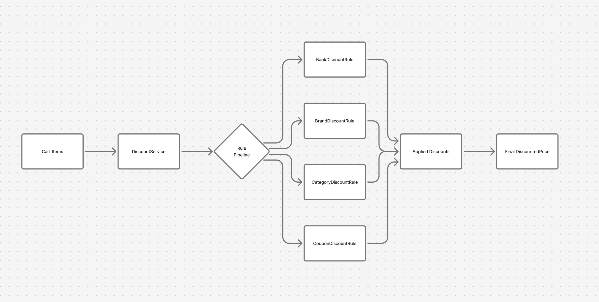

Unifize Discount Engine

A modular, extensible discount calculation engine for a fashion e-commerce platform.
Implements brand discounts, category deals, coupon validation, and bank offers using a clean Rule Pipeline based on the Strategy Pattern.

🔥 Features

Pluggable discount rules (Strategy Pattern)

Rule pipeline: Brand → Category → Coupon → Bank

Coupon validation:

🔒 Brand exclusions

🏷️ Category restrictions

⭐ Customer tier requirements

Clean separation of:

Rule logic

Service orchestration

Validation

Fully async pipeline

Tests included (pytest)

Example usage (examples/run_example.py)

Architecture diagram

🧩 Project Structure
discount_engine/
    models/                → Core data models
    services/
        rules/             → Rules: brand, category, coupon, bank
        validators/        → Coupon + cart validation logic
        discount_service.py → Applies rule pipeline
examples/
tests/
README.md

🧠 Architecture Overview
Strategy Pattern (Rule Modules)

Each discount type is its own class:

BrandDiscountRule

CategoryDiscountRule

CouponDiscountRule

BankDiscountRule

All inherit from:

class DiscountRule(ABC):
    async def apply(self, cart_items, customer, current_price, payment_info) -> Decimal:

This allows:

adding new rules in minutes

changing discount logic without touching the engine

clean testing

Rule Pipeline (DiscountService)

Order matters — just like in real e-commerce systems:

Brand discount

Category discount

Coupon validation & discount

Bank offer

Each rule returns:

discount amount (not the new price)

DiscountService orchestrates everything.

## 📊 Architecture Diagram (Figma)

  

▶️ Running the Example
python -m examples.run_example

Example Output:

Original Price: 1000
Final Price: 486
Applied Discounts: {...}

🧪 Running Tests
python -m pytest -q

📝 Assumptions

Discounts defined in dummy data (assignment requirement)

Only one coupon at a time

No edge-case conflict-resolutions (assignment: happy-path only)

Async structure for future external API integrations

🧠 Technical Decisions

Strategy Pattern → Extensible rule modules

Pipeline Architecture → Predictable discount ordering

Validation Layer → Early rejection of invalid coupons

Async-first → Future-proof for real integrations

Separation of concerns →

rules

validation

service

tests

models

🚀 Future Enhancements

Data-driven discount configs

Multi-coupon stacking engines

Buy X Get Y rules

Tiered pricing engine

Real-time AB-testing

Branch protection rules enabled:
- PR required for develop/main
- GitHub Actions CI must pass before merge

👤 Author

Implementation by Tabrez Ansari
Engineering Manager Candidate – Unifize Assignment
